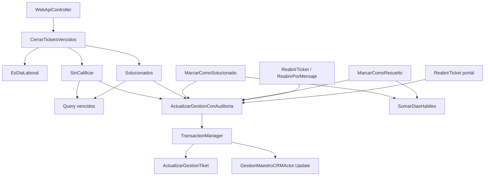
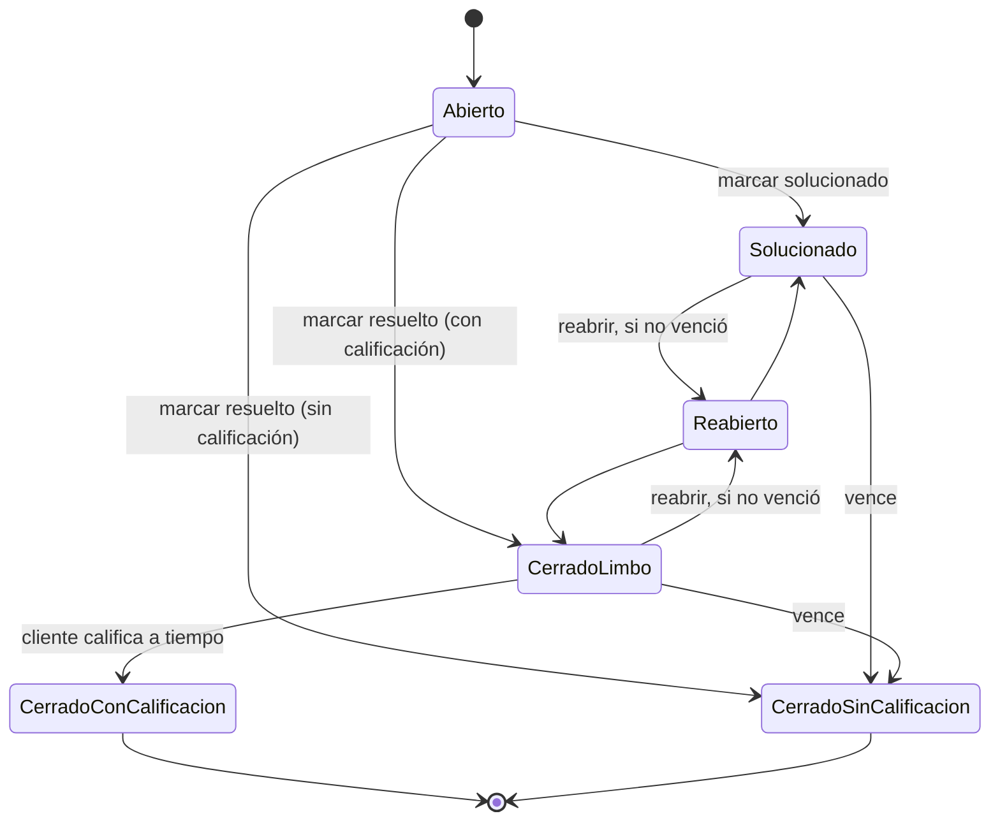
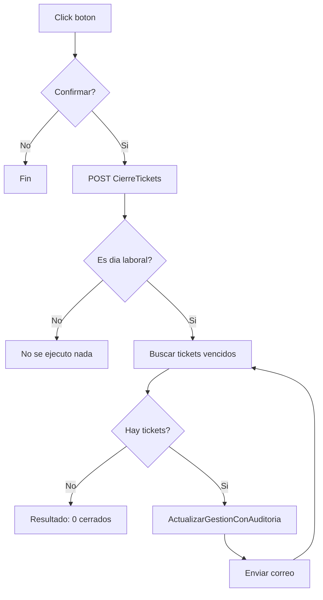

# Implementación — Cierre manual de tickets vencidos (respetando el calendario)

> Reference: qué quedó construido, archivo por archivo. Se actualiza si el código cambia.
> Para el porqué de cada decisión ver [`PLAN.md`](./PLAN.md), [`REQUERIMIENTO.md`](./REQUERIMIENTO.md),
> [`VALIDACION-ESTADO-CIERRE.md`](./VALIDACION-ESTADO-CIERRE.md) y [`EXPLICACION.md`](./EXPLICACION.md).

## Diagrama de flujo

### Dependencias — quién llama a quién

| Nodo | Archivo |
|---|---|
| `WebApiController` | `PruebaPostgreSQL/Controllers/WebApi/SoporteConfiguracionWebApiController.cs` |
| `CerrarTicketsVencidos`, `SinCalificar`, `Solucionados`, `EsDiaLaboral` | `Negocio/Soporte/SoporteCalificacionActorNegocio.cs` (los dos primeros) y `SoporteCalendarioActorNegocio.cs` (`EsDiaLaboral`) |
| `SumarDiasHabiles` | `Negocio/Soporte/SoporteCalendarioActorNegocio.cs` |
| `MarcarComoSolucionado`, `MarcarComoResuelto`, `ReabrirTicket`, `ReabrirPorMensaje`, `ActualizarGestionConAuditoria` | `Negocio/Crm/GestionMaestroCRMActorNegocio.cs` |
| `ReabrirTicket portal` | `Negocio/Portal/PortalSoporteTicketActorNegocio.cs` |
| `TransactionManager` | `Negocio/TransactionUtil/TransactionManager.cs` |
| `Query vencidos`, `ActualizarGestionTiket`, `GestionMaestroCRMActor.Update` | `Blip.Data/Crm/GestionMaestroCRMActorNegocio.cs`, `Blip.Data/Soporte/SoporteAuditoriaActorNegocio.cs` |

### Ciclo de vida del ticket

| Transición | Qué fecha fija |
|---|---|
| Abierto → Solucionado | `Tiempolimitesolucionado = SumarDiasHabiles(now, diasVentanaSolucionado)` |
| Abierto → CerradoLimbo | `Tiempocalificacion = SumarDiasHabiles(now, diasVentanaCalificacion)` |
| Abierto → CerradoSinCalificacion | `Fechacierre = now` (definitivo) |
| Solucionado / CerradoLimbo → CerradoSinCalificacion (vence) | `Fechacierre = now` (definitivo) |
| CerradoLimbo → CerradoConCalificacion | `Fechacierre = now` (definitivo) |
| → Reabierto | limpia `Fechacierre`, `Tiempocalificacion`, `Tiempolimitesolucionado` |

`CerradoLimbo` y `Solucionado` son los únicos estados reabribles (mientras su ventana no venza) — ver
`ObtenerEstadoCierre` / `EstaCerradoDefinitivamente`. `CerradoConCalificacion` y
`CerradoSinCalificacion` son definitivos, no se salen de ahí. "Reabrir, si no venció" compara ahora
timestamp completo (`< CURRENT_TIMESTAMP` / `< DateTime.Now`, ver sección de precisión más abajo);
si ya venció, en vez de reabrir se fuerza el cierre en caliente.

### Ejecución del botón manual

`ActualizarGestionConAuditoria` fija `Fechacierre = now` y `Idestado = CerradoSinCalificación` dentro
de una transacción atómica (auditoría + update juntos). Un ticket con error no interrumpe el resto —
catch por ticket, la próxima ejecución manual reintenta el que falló si sigue vencido.

## Calendario hábil

**`Negocio/Soporte/SoporteCalendarioActorNegocio.cs`**

- `EsDiaLaboral(DateTime p_fecha)` — indica si una fecha es día laboral (jornada semanal +
  excepciones), sin considerar franja horaria. Gate del botón manual.
- `SumarDiasHabiles(DateTime p_inicio, int p_dias)` — suma N días hábiles completos a partir de
  `p_inicio` (que no cuenta como consumido) y devuelve el fin de la última franja del N-ésimo día
  hábil. Un día con al menos una franja configurada (aunque sea media jornada) cuenta como un día
  completo; un día sin franjas (festivo, o `Eslaboral=false`) no cuenta. Reusa el `ObtenerJornada`
  privado ya usado por `CalcularFechaLimiteHabil` (SLA) — mismo criterio, no inventado para esta
  feature.

## Orquestación del cierre por vencimiento

**`Negocio/Soporte/SoporteCalificacionActorNegocio.cs`**

- `CerrarTicketsVencidosSinCalificar(string idUsuario)` — cierra tickets en limbo "Cerrado" cuya
  ventana de calificación venció. Devuelve la cantidad cerrada con éxito (antes `void`). Recibe
  `idUsuario` para auditar quién disparó el cierre manual (antes se auditaba con `null`). Fija
  `Fechacierre = DateTime.Now` (ver `VALIDACION-ESTADO-CIERRE.md`, Duda 1).
- `CerrarTicketsVencidosSinCalificarSolucionados(string idUsuario)` — mismo patrón para tickets en
  "Solucionado" cuya ventana venció sin reapertura.
- `CerrarTicketsVencidos(string idUsuario)` — orquestador: verifica `EsDiaLaboral(DateTime.Now)`,
  si no lo es devuelve `Ejecutado = false` sin tocar nada; si lo es, corre los dos métodos anteriores
  y arma el `ResultadoCierreTicketsVencidos`.
- Ambos métodos de cierre: `try/catch` por ticket dentro del `foreach` — un ticket con error no
  bloquea a los demás; la próxima ejecución manual lo reintenta si sigue vencido.

**`Negocio/Soporte/ResultadoCierreTicketsVencidos.cs`** — DTO de respuesta: `Ejecutado`, `Mensaje`,
`TicketsCerradosSinCalificar`, `TicketsCerradosSolucionados`.

## Cierre de Día

**`Negocio/Cierres/CierreDiaViewModel.cs`** — se eliminó el `#region tickets` (paso 13 de 14):
el Cierre de Día ya no toca tickets. Único dueño de la regla: el botón manual.

## Botón manual

**`PruebaPostgreSQL/Controllers/WebApi/SoporteConfiguracionWebApiController.cs`** —
`[HttpPost] CierreTickets()`: toma el usuario autenticado (`User.Identity.GetUserId()`) y delega en
`SoporteCalificacionActorNegocio.CerrarTicketsVencidos(usuario)`.

**`PruebaPostgreSQL/Views/SoporteParametros/_TabConfiguracionSoporte.cshtml`** — botón "Ejecutar
cierre de tickets vencidos" (`ButtonType.Danger`, acción destructiva) sobre el grid de
`SoporteConfiguracion`. `dxConfirm` antes de disparar, `LoadPanel` durante la llamada, AJAX contra
`api/SoporteConfiguracionWebApiController/CierreTickets`, `dxNotify` con el `Mensaje` del resultado
(`success` si `Ejecutado`, `warning` si no — ej. "hoy no es día laboral").

## Ventana en días hábiles

**`Negocio/Crm/GestionMaestroCRMActorNegocio.cs`**

- `MarcarComoSolucionado` — `Tiempolimitesolucionado` se calcula con
  `SoporteCalendarioActorNegocio.SumarDiasHabiles(DateTime.Now, diasVentana)` en vez de
  `DateTime.Now.AddDays(diasVentana)`.
- `MarcarComoResuelto` — mismo cambio para `Tiempocalificacion` (rama `TieneCalificacion`), usando
  `diasCalificacion`. Confirmado con negocio que aplica igual que la ventana de solucionado.
- Aplica solo hacia adelante: tickets con ventana ya fijada en días corridos no se recalculan.

## Transacción atómica en auditoría + update de tickets

Hallazgo posterior a la Fase 2: `SoporteAuditoriaActor.ActualizarGestionTiket` (hasta 25 `INSERT`
independientes, uno por campo modificado) y `GestionMaestroCRMActor.Update` corrían sin ninguna
transacción en común — un fallo a mitad de camino podía dejar un ticket con auditoría parcial y sin
el cambio de estado real (o viceversa). El mismo patrón (sin transacción) se repetía en otros 10
puntos del módulo CRM/Soporte, no solo en el cierre de vencidos.

**`Negocio/TransactionUtil/TransactionManager.cs`** (nuevo) — `ExecuteTransaction(Action
transactionalAction)`: envuelve la acción en `TransactionScope` (`TransactionUtils.CrearTransaccion()`)
+ `GeneralDao.Connection`, con `finally` que siempre cierra y limpia la conexión del hilo
(`GeneralDao.Connection = null`), haya éxito o rollback.

**`Negocio/Crm/GestionMaestroCRMActorNegocio.cs`** — método nuevo
`ActualizarGestionConAuditoria(gestionAnterior, gestionActual, idUsuario, idPortalUsuario = null)`:
único punto que llama a `SoporteAuditoriaActor.ActualizarGestionTiket` + `GestionMaestroCRMActor.Update`
dentro de `TransactionManager.ExecuteTransaction`. El envío de correo (`EnviarCorreoCambioEstado`)
queda fuera de la transacción — efecto sin BD, no debe poder revertir cambios ya confirmados.

Reemplazó el patrón repetido (auditoría + update sueltos) en **12 sitios**:

| Archivo | Métodos |
|---|---|
| `Negocio/Crm/GestionMaestroCRMActorNegocio.cs` | `ActualizarDatosSoporte`, `MarcarComoResuelto`, `ReabrirTicket` (3 sitios), `ReabrirPorMensaje` (2 sitios), `MarcarComoSolucionado` |
| `Negocio/Portal/PortalSoporteTicketActorNegocio.cs` | `ReabrirTicket` (portal cliente, 2 sitios) |
| `Negocio/Soporte/SoporteCalificacionActorNegocio.cs` | `CerrarTicketsVencidosSinCalificar`, `CerrarTicketsVencidosSinCalificarSolucionados` |

## Precisión de fecha/hora en vencimiento (query + reabrir)

Con `SumarDiasHabiles` las fechas límite ganaron una hora exacta (fin de jornada), lo que dejó en
evidencia comparaciones existentes que truncaban esa fecha a solo el día:

- **`Blip.Data/Crm/GestionMaestroCRMActorNegocio.cs`** (`ObtenerTicketsCalificacionVencida`,
  `ObtenerTicketsSolucionVencida`): `< CURRENT_DATE` → `< CURRENT_TIMESTAMP` — antes, todo ticket
  necesitaba un día calendario extra después de su vencimiento real antes de que el botón de cierre
  lo detectara (hallazgo H3 del análisis original, que con días hábiles pasó a ocurrir siempre en
  vez de ocasionalmente). Se usa `CURRENT_TIMESTAMP` por consistencia con
  `Blip.Data/Soporte/SoporteVistaDashboardActorNegocio.cs:41` (mismo patrón para el SLA).
- **`Negocio/Crm/GestionMaestroCRMActorNegocio.cs`** (`ReabrirTicket` — 2 chequeos,
  `ReabrirPorMensaje` — 1 chequeo) y **`Negocio/Portal/PortalSoporteTicketActorNegocio.cs`**
  (`ReabrirTicket` — 2 chequeos): `.Value.Date < DateTime.Today` → `.Value < DateTime.Now` — antes
  dejaba reabrir un ticket hasta medianoche del día en que venció, aunque el límite real ya hubiera
  pasado (ej. venció a las 6pm, se podía reabrir hasta las 11:59pm).

**No se agregó ninguna restricción de horario laboral al botón de cierre** — `EsDiaLaboral` sigue
validando solo que hoy sea día laboral, no la hora; cerrar tickets a cualquier hora del día (ej.
8pm) sigue funcionando sin problema. Decisión explícita: la precisión se corrige donde se compara
contra el límite guardado, no agregando una validación de horario nueva.

## Fuera de alcance (decisiones ya tomadas, no se tocaron)

- El Cierre de Día no lleva red de respaldo para tickets — se sacó por completo (Fase 3), a
  diferencia de lo que contemplaba `ANALISIS-CIERRE-JOB.md` originalmente.
- No hay job/timer automático — el disparo es 100% manual (botón), decisión explícita del
  `REQUERIMIENTO.md`.
- Tickets con ventanas ya fijadas en días corridos antes de este cambio no se recalculan.
- Estado explícito de "SLA cumplido/incumplido" al cerrar el ticket (comparando fecha de cierre vs.
  fecha límite) — propuesto durante la indagación con el cliente (ver `REQUERIMIENTO.md`), **no
  implementado**, pendiente para otro ciclo.
